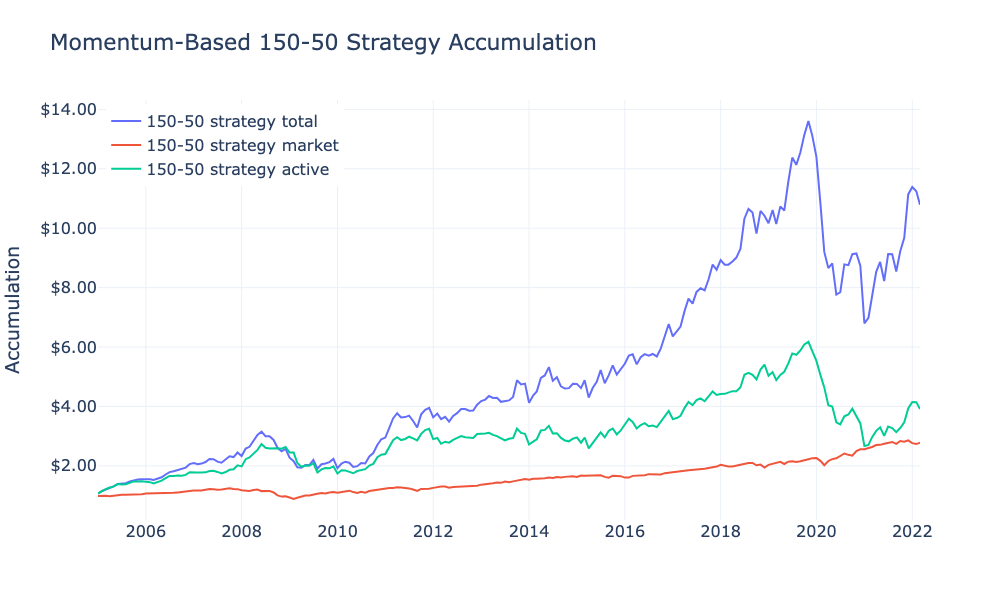

# Project Description

This repository contains Jupyter Notebook files for two projects:

- project1.ipynb: Momentum-Based 150/50 Strategy
- project2.ipynb: Growth and Profitability Strategy Features

# Sample Work: Momentum-Based 150/50 Strategy

This document provides a sample of the analysis conducted for the Momentum-Based 150/50 Strategy project. It includes visualizations of key performance metrics and figures illustrating the strategy's performance.

## Performance Metrics

### Sharpe Ratio
The annualized Sharpe ratio of the Momentum-Based 150/50 Strategy is calculated to be 73.71%, indicating a high return per unit of risk.

### Mean Return
The mean return of the strategy is 0.01232, with a standard deviation of 0.05789.

## Accumulation Chart

*Figure 1: Accumulation of the Momentum-Based 150/50 Strategy.*

The accumulation chart above illustrates the performance of the strategy over time, showing steady growth and positive returns.

## Statistical Analysis

### Jensen's Alpha
Jensen's alpha of the Momentum-Based 150/50 Strategy is calculated to be 0.00806, indicating its outperformance relative to the market after adjusting for market risk.

### Fama-French Alpha
The Fama-French alpha of the strategy is 0.00385, further confirming its capability to generate excess returns over the Fama-French factors.

## Conclusion
Overall, the Momentum-Based 150/50 Strategy demonstrates strong performance across various metrics, outperforming market benchmarks and generating excess returns. This sample provides insights into the strategy's effectiveness and its potential utility for investors.

For the complete analysis and additional details, refer to the full Jupyter Notebook available in the repository.

